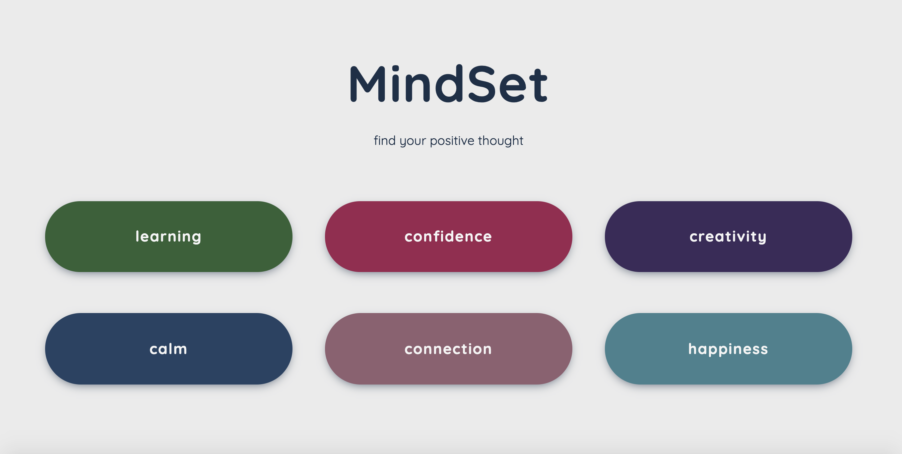
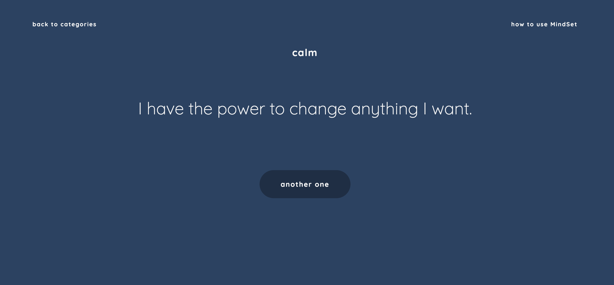

# MindSet - find your positive thought :relaxed:

MindSet is a mobile-responsive web app to help the user find and use positive affirmations. The user selects the category of affirmation they want to see, and a random affirmation in that category is generated. The app also includes instructions and background on using positive affirmations.

MindSet was built without frameworks, libraries, plugins, or pre-processors, just for fun. :sparkles:

## Usage :desktop_computer:	

To run locally, clone the repository to your machine and open in your browser.

## Credits :woman_technologist:

Built by Cori Lint, with the help of [Free Code Camp](https://www.freecodecamp.org/learn), [Wes Bos](https://wesbos.com/), and [Google](http://google.com).